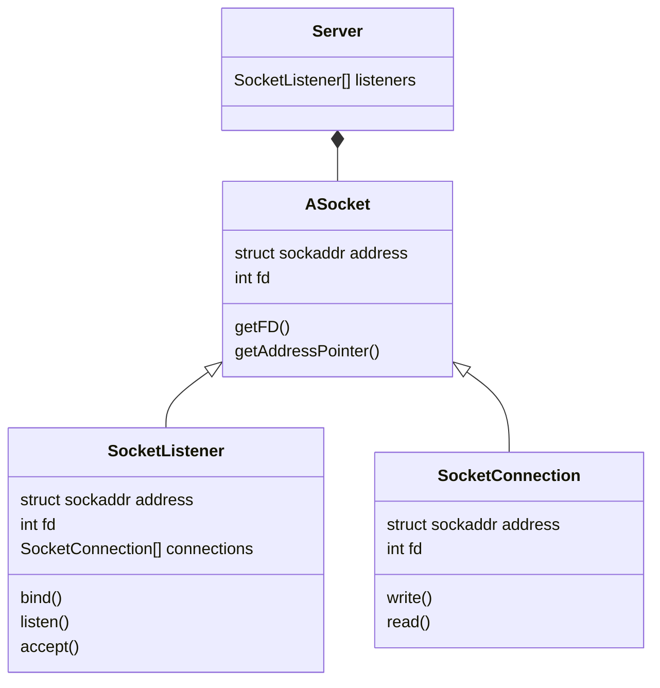

# Webserv

```mermaid
classDiagram

class ASocket
ASocket   :   getFD()
ASocket   :   getAddressPointer()
ASocket   :   struct sockaddr address
ASocket   :   int fd

class SocketListener
SocketListener  :   bind()
SocketListener  :   listen()
SocketListener  :   accept()
SocketListener  :   struct sockaddr address
SocketListener  :   int fd
SocketListener  :   SocketConnection[] connections


class SocketConnection
SocketConnection    :   struct sockaddr address
SocketConnection    :   int fd
SocketConnection   :   write()
SocketConnection   :   read()

class Server
Server  :   SocketListener[] listeners

ASocket <|-- SocketListener
ASocket <|-- SocketConnection
Server *--ASocket
```